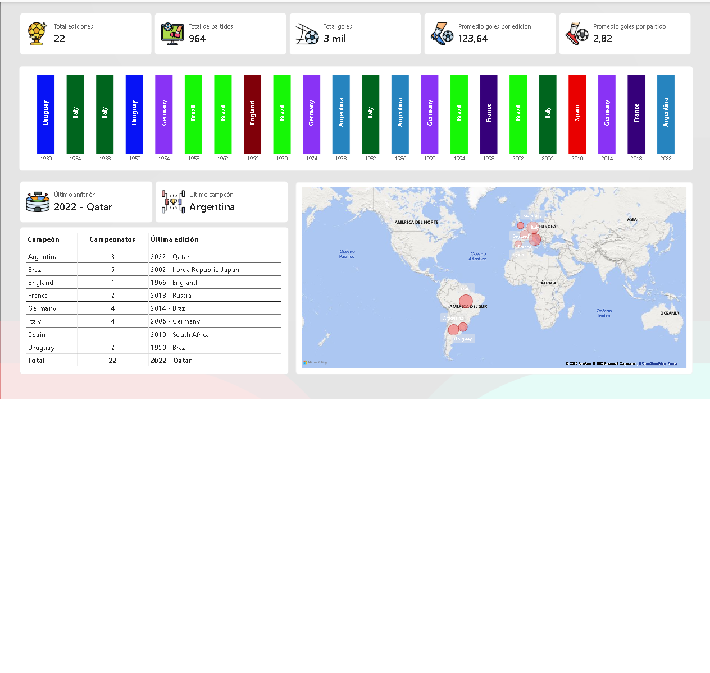

# ⚽ FIFA World Cup — Power BI Dashboard

## 📊 Project Overview

This project presents an interactive Power BI dashboard developed to explore and analyze historical FIFA World Cup data.

The dashboard combines information about matches, teams, players, goals, tournament performance, and other relevant statistics to transform raw data into clear and actionable visual insights.

## 🎯 Objectives

* Explore and understand historical FIFA World Cup data.
* Analyze match and team performance.
* Examine goals and tournament statistics.
* Explore player performance and relevant metrics.
* Clean and transform data using Power Query.
* Build a structured data model for analysis.
* Create calculated measures using DAX.
* Develop interactive KPIs and visualizations.
* Present insights through an interactive Power BI dashboard.

## 🛠️ Tools & Technologies

* **Power BI**
* **Power Query**
* **DAX**
* **Data Modeling**
* **Data Visualization**
* **Git / GitHub**

## 📈 Dashboard

The dashboard provides interactive visualizations for exploring historical World Cup data, including match results, team performance, goals, players, and tournament statistics.

### Dashboard Preview



## 🔄 Data Preparation

The project follows a data analytics workflow:

**Raw Data → Data Cleaning → Transformation → Data Modeling → DAX Measures → Visualization → Insights**

Data preparation includes:

* Data type validation
* Data cleaning
* Handling missing or inconsistent values
* Data transformation
* Data modeling
* Relationship creation
* Creation of calculated measures
* KPI development

## 📌 Key Skills Demonstrated

* Data cleaning and preparation
* Data transformation with Power Query
* Data modeling
* DAX calculations
* KPI development
* Interactive dashboard design
* Data visualization
* Exploratory data analysis
* Analytical thinking
* Git and GitHub project management

## 📁 Project Structure

```text
Dashboard_FIFA_World_Cup/
│
├── Dashboard_FIFA_World_Cup.pbip
├── Dashboard_FIFA_World_Cup.Report/
├── Dashboard_FIFA_World_Cup.SemanticModel/
├── README.md
└── images/
    └── dashboard_fifa_world_cup.png
```

## 📚 Data Source

Historical FIFA World Cup dataset used for educational and portfolio analysis purposes.

The original raw data files are not included in this repository.

## 👩‍💻 Author

**Adriana Elizabeth Gómez**

Junior Data Analyst focused on data analysis, visualization, SQL, Python, Excel, and Power BI.
